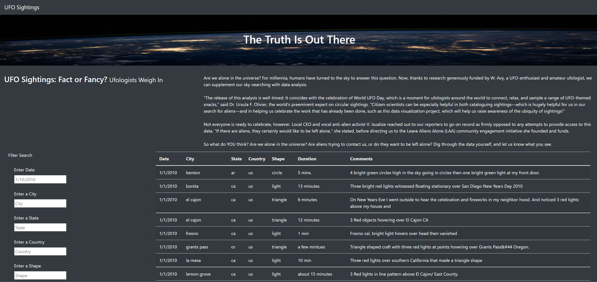

# UFOs

## Overview of Project
The client has requested a website with a dynamic table of UFO Sighting articles. The table should allow users to filter by multiple criteria at the same time. The filter should be date, city, state, country, and shape.

## Resources
Data Source: data.js

Software: HTML, CSS, JavaScript, Bootstrap  

## Results
The webpage has filter inputs that allow the user to search by typing a string and pressing enter. The user can search by Date, City, State, Country, and/or Shape. The table will filter the articles by the user's input.

## Summary
The major drawback of the current filter is the exact match functionality. The user must know exact string and letter casing to use the search function.

Two recommendations to improve the search filter:
1. Extend the search function to be case insensitive.
2. Allow for partial matches to return results.